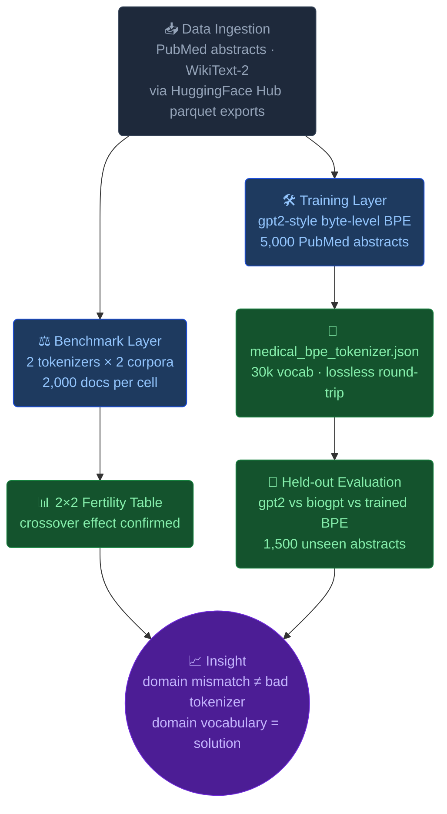

<div align="center">

<br/>

```
 ███╗   ███╗███████╗██████╗       ████████╗ ██████╗ ██╗  ██╗███████╗███╗   ██╗███████╗██████╗
 ████╗ ████║██╔════╝██╔══██╗      ╚══██╔══╝██╔═══██╗██║ ██╔╝██╔════╝████╗  ██║██╔════╝██╔══██╗
 ██╔████╔██║█████╗  ██║  ██║         ██║   ██║   ██║█████╔╝ █████╗  ██╔██╗ ██║█████╗  ██████╔╝
 ██║╚██╔╝██║██╔══╝  ██║  ██║         ██║   ██║   ██║██╔═██╗ ██╔══╝  ██║╚██╗██║██╔══╝  ██╔══██╗
 ██║ ╚═╝ ██║███████╗██████╔╝         ██║   ╚██████╔╝██║  ██╗███████╗██║ ╚████║███████╗██║  ██║
 ╚═╝     ╚═╝╚══════╝╚═════╝          ╚═╝    ╚═════╝ ╚═╝  ╚═╝╚══════╝╚═╝  ╚═══╝╚══════╝╚═╝  ╚═╝
```

### *Does your tokenizer speak medicine?*

<br/>

[](https://www.python.org)
[](https://huggingface.co)
[](https://docs.astral.sh/uv/)
[](https://colab.research.google.com)
[](LICENSE)

<br/>

> **TL;DR** — A general-purpose tokenizer fragments `amoxicillin-clavulanate` into **28 pieces**.
> A medical tokenizer handles it in **18**. This project measures that gap, explains why it happens, and then trains a custom tokenizer that closes it — in under a minute on CPU.

<br/>

</div>

---

## What problem does this solve?

Large language models have a fixed context window. Every token that window swallows is compute spent. If your tokenizer shatters clinical terms into meaningless sub-pieces, you're paying a **domain tax** — wasting context, inflating inference cost, and leaking signal.

`med-tokener` quantifies this tax with reproducible numbers, traces it back to vocabulary design choices, and demonstrates how a tiny BPE training run can recover most of the lost efficiency.

---

## The experiment, in three stages

```
Stage 1 — Benchmark          Stage 2 — Diagnose            Stage 3 — Fix
─────────────────────        ─────────────────────         ─────────────────────
Compare gpt2 vs biogpt  ──►  Prove it's the vocab,   ──►  Train byte-level BPE
on PubMed + WikiText-2       not the model itself          on 5k PubMed abstracts
Crossover confirms it's      (Bio_ClinicalBERT vs          Held-out eval shows
domain mismatch              PubMedBERT case study)        efficiency recovered
```

### Stage 1 — The crossover effect

When you run `gpt2` and `biogpt` on **both** medical and general text, the efficiency relationship **flips** depending on the domain. This crossover is the fingerprint of domain mismatch — not tokenizer quality.

| Tokenizer | PubMed fertility ↓ | WikiText-2 fertility ↓ | Held-out PubMed ↓ |
|---|:---:|:---:|:---:|
| `gpt2` (general) | 1.337 | **1.167** | 1.345 |
| `biogpt` (medical) | **1.134** | 1.298 | **1.137** |
| Our trained BPE | — | — | 1.183 |

> **Fertility** = tokens per word. Source: Rust et al., 2021. Lower is better.

### Stage 2 — The "medical model" trap

Having a model trained on biomedical text is not the same as having a medical *tokenizer*. `Bio_ClinicalBERT` uses a mostly standard WordPiece vocabulary. `PubMedBERT` was built from scratch on PubMed, giving it a genuinely medical sub-word vocabulary. Same medical domain — very different token economies.

### Stage 3 — Train your own, in one minute

```
gpt2   (28 tokens): ['The', 'Ġpatient', 'Ġwas', 'Ġprescribed', 'Ġam', 'oxic', 'illin', '-',
                     'cl', 'av', 'ul', 'an', 'ate', '...', 'Ġe', 'ch', 'oc', 'ardi', 'ography', '.']

biogpt (18 tokens): ['The</w>', 'patient</w>', 'was</w>', 'prescribed</w>', 'amoxicillin</w>',
                     '@-@</w>', 'clavul', 'anate</w>', '...', 'echocardiography</w>', '.</w>']

ours   (trained on 5k PubMed abstracts — fertility 1.183 on held-out set)
```

---

## Architecture



---

## Quickstart

### Option A — Zero install (Google Colab)

| Step | Action |
|------|--------|
| 1 | Open [colab.research.google.com](https://colab.research.google.com) |
| 2 | `File → Upload notebook` → select `notebooks/medical_tokenizer_comparison.ipynb` |
| 3 | `Runtime → Run all` |

Free tier, < 10 minutes end-to-end. Only extra dependency: `sacremoses`.

---

### Option B — Local with `uv` *(recommended)*

```bash
# Clone
git clone https://github.com/Murtuzasaifee/med-tokener.git && cd med-tokener

# Bootstrap environment (Python 3.12 + all deps, ~30 s on first run)
uv sync

# Run the full pipeline
uv run med-tokener
```

---

### Option C — Local with `pip`

```bash
git clone https://github.com/Murtuzasaifee/med-tokener.git && cd med-tokener
pip install -e .
med-tokener
```

> **First-run note:** ~350 MB of parquet files + tokenizer weights are downloaded and cached by the Hugging Face Hub. Subsequent runs are instant.

---

## CLI Reference

```
Usage: med-tokener [OPTIONS]

Options:
  --n-metrics      INT   Documents per corpus used for the 2×2 benchmark  [default: 2000]
  --n-train        INT   PubMed abstracts used to train the BPE model     [default: 5000]
  --n-heldout      INT   Held-out abstracts for final evaluation           [default: 1500]
  --vocab-size     INT   BPE vocabulary size                               [default: 30000]
  --min-frequency  INT   Minimum token frequency for BPE merges            [default: 2]
  --seed           INT   Random seed for reproducibility                   [default: 42]
  --output         PATH  Output path for the trained tokenizer JSON        [default: medical_bpe_tokenizer.json]
  -h, --help             Show this message and exit
```

**Quick smoke test (~2 min, CPU):**
```bash
med-tokener --n-train 1000 --vocab-size 10000
```

---

## Project layout

```
med-tokener/
│
├── src/med_tokener/
│   ├── __init__.py          ← package entry point
│   └── pipeline.py          ← full CLI pipeline (data → train → evaluate)
│
├── notebooks/
│   └── medical_tokenizer_comparison.ipynb   ← interactive walkthrough, Colab-ready
│
├── docs/images/
│   └── fertility_results.png   ← benchmark chart
│
├── pyproject.toml   ← project metadata, deps, entry points
└── README.md
```

---

## Dependencies

| Package | Purpose |
|---------|---------|
| [`tokenizers`](https://huggingface.co/docs/tokenizers) | Rust-backed BPE: `Tokenizer.from_pretrained`, `BpeTrainer`, `train_from_iterator` |
| [`transformers`](https://huggingface.co/docs/transformers) | `AutoTokenizer` for fairseq-style repos (BioGPT) |
| [`datasets`](https://huggingface.co/docs/datasets) | Stream PubMed abstracts and WikiText-2 from parquet |
| [`huggingface_hub`](https://huggingface.co/docs/huggingface_hub) | Download individual parquet shards with `hf_hub_download` |
| `sacremoses` | Moses tokenizer — runtime dep of the legacy BioGPT tokenizer |
| [`uv`](https://docs.astral.sh/uv/) | Dependency resolution, venv management, CLI entry point |

---

## Key concept: what is fertility?

**Fertility** (Rust et al., 2021) measures how many tokens a tokenizer generates per input word.

```
fertility = total_tokens / total_words
```

A fertility of `1.0` means every word maps to exactly one token — perfectly efficient for that domain.
Values above `1.0` mean the tokenizer is splitting words into sub-pieces, spending extra context budget.

The **crossover** in the results table above is the central finding: `gpt2` is more efficient on WikiText-2 (`1.167`), while `biogpt` is more efficient on PubMed (`1.134`). Swap the domain and the ranking flips. Domain mismatch, not raw tokenizer quality.

---

## Going deeper

| Question | Hint |
|---|---|
| How many more medical tokens fit in a 4k context window with `biogpt` vs `gpt2`? | Compute `(1.345 - 1.137) / 1.345` |
| When would a *smaller* vocabulary be preferable despite higher fertility? | Think: rare disease terms, cross-lingual transfer, memory on edge devices |
| Can you find a term that even `biogpt` over-segments? | Try `hydroxychloroquine` or `pseudohypoparathyroidism` |
| What happens to fertility if you train BPE on 50k vs 5k abstracts? | Try `--n-train 50000 --vocab-size 50000` |

---

## References

- Rust, P. et al. (2021). [*How Good is Your Tokenizer? On the Monolingual Performance of Multilingual Language Models.*](https://arxiv.org/abs/2012.15613) ACL 2021. *(defines the fertility metric)*
- Beltagy, I. et al. (2019). [*SciBERT: A Pretrained Language Model for Scientific Text.*](https://arxiv.org/abs/1903.10676) EMNLP 2019. *(domain vocabulary)*
- Gu, Y. et al. (2021). [*Domain-Specific Language Model Pretraining for Biomedical Natural Language Processing.*](https://arxiv.org/abs/2007.15779) ACM Health. *(PubMedBERT vocabulary ablations)*
- Hugging Face. [*Tokenizers — Quick Tour.*](https://huggingface.co/docs/tokenizers/quicktour)
- Radford, A. et al. (2019). [*Language Models are Unsupervised Multitask Learners.*](https://cdn.openai.com/better-language-models/language_models_are_unsupervised_multitask_learners.pdf) *(GPT-2 and BPE)*

---

